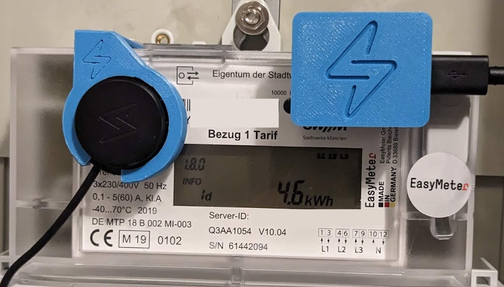
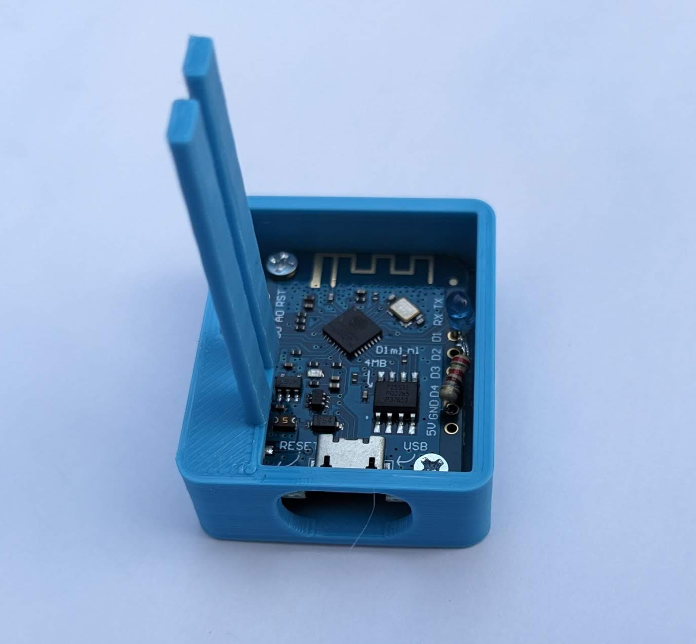

# Session Extender for Easymeter electricity meter

In normal mode an _Easymeter Q3A_ electricity meter merely provides a reduced set and less detailed measurements via the _INFO-DSS_ IR interface.
The extended mode can be enabled by entering the PIN code which you can get from the meter operator.
Unfortunately, the meter falls back to normal mode after 120s of inactivity.
To keep it in extended mode, this project simply lets an IR LED blink towards the IR button every few seconds.

## Hardware:

- 1 Wemos D1 Mini Pro V3.0.0
- IR LED (removed from an old TCRT5000)
- 220 Ω Resistor
- 2 2x5mm screws (I used 2x10mm cut in half)

Then solder the LED and Resistor like that:

_D1 <--> LED <--> Resistor <--> GND_

The LED has to be exactly above D1 to point directly on the IR button of the Easymeter.

## 3D Print

Print [STL file](./PulseFixation.stl) with your 3D printer (no support structures needed) and fix the Wemos D1 Mini Pro with the screws. More details on my [Thingiverse](https://www.thingiverse.com/thing:6083115) project.

## More technical details

The _INFO-DSS_ IR interface sends data encoded in SML, the _Smart Message Language_, standardized by [BSI TR-03109-1](https://www.bsi.bund.de/SharedDocs/Downloads/DE/BSI/Publikationen/TechnischeRichtlinien/TR03109/TR-03109-1_Anlage_Feinspezifikation_Drahtgebundene_LMN-Schnittstelle_Teilb.pdf?__blob=publicationFile).
A message starts with _1b 1b 1b 1b 01 01 01 01_ and ends with _1b 1b 1b 1b 1a_.
In the value list within the message body the actual data records are identified by [IEC62056 OBIS](https://www.promotic.eu/en/pmdoc/Subsystems/Comm/PmDrivers/IEC62056_OBIS.htm), e.g. _OBIS 1-0:1.8.0_ for the _positive active energy_, i.e. the total obtained energy.
In normal mode an exemplary value for this data record has no decimal fraction, e.g. 8864 kWh.
In extended mode the meter returns 8864.2906391 kWh which has 7 decimal places - a much higher accuracy.
Furthermore, in extended mode additional data records like _OBIS 1-0:16.7.0_, which is the _sum active instantaneous_ power, i.e. the current power, are returned.

More details can be found in this [article](https://medium.com/@mroeckl/höre-was-dein-stromzähler-dir-zu-sagen-hat-smart-message-language-de18556fc4b4) (German).

## FAQ

1. **Why have I used a Wemos D1 Mini Pro - isn't it too powerful for this simple task?** _Absolutely but I had this hardware at home and I did not want to order new hardware._

2. **Why didn't I simply enable the extended mode in the menu long term?** _This is not supported by the configuration of my electricity meter._

3. **Why havn't I simply used the MSB-DSS IR interface on the top?** _It is sealed by my meter operator and I am not allowed to remove it._

4. **Where can I find this nice mount for the Tibber Pulse IR which is shown on the photo?** _Here you go: [Tibber Pulse Fixation for Easymeter.](https://www.thingiverse.com/thing:6083117)_

## Disclaimer

This is a personal project. Usage of the provided information is on your own risk.
